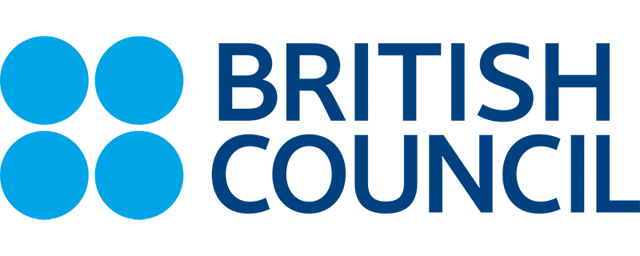

# Introducción a Github

## Charla-Taller 

Taller desarrollado por el **Google Developer Student Club de la Universidad de Guanajuato** en colaboración por parte del programa _**SKILLS FOR WOMEN IN TECH**_  y junto a **BRITISH COUNCIL** para la capacitación-actualización de un grupo de estudiantes y profesores de la Casa de Estudios. 

## Ponente

| Nombre                                  | Actividad Laboral/Academica                                          |
| -----------------------------------     |:--------------------------------------------------------------------:|
| _Jesús Armando López García_            | Instructor/Google DSC Lead /Data Intelligence Manager                |

## Aliados

## Asistentes y tres cosas que te gusten

* Jesús López 
- Me gusta programar en python 🐍
- Salir a correr 💻
- Ver series 👌

* Juan Perez
- El cine
- Leer
- Salir a correr

*Rosa Maria
-Hacer ejercicio
-Viajar
-estar con mi familia❤
